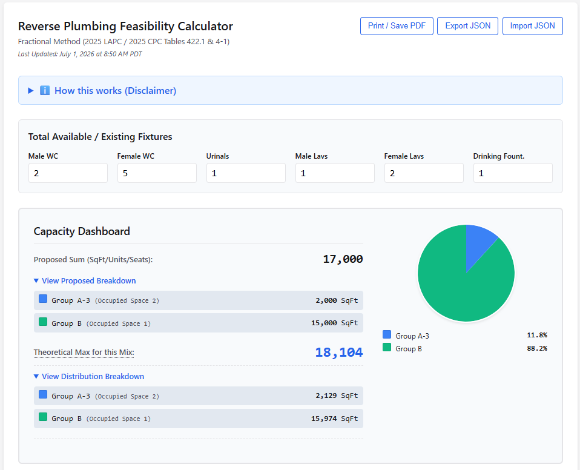
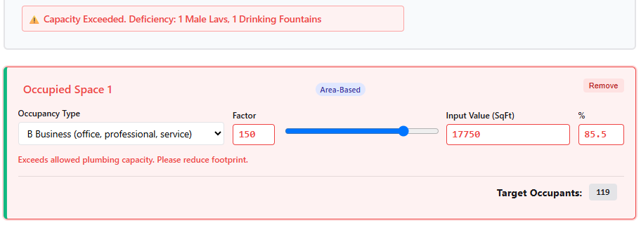
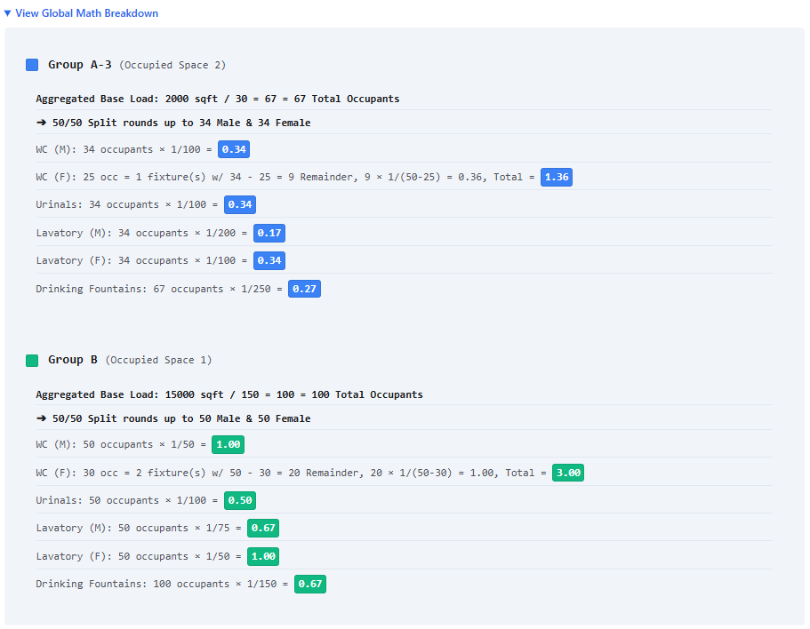

# LAPC Reverse Fixture Calculator

Welcome to the **LAPC Reverse Fixture Calculator**, a specialized tool designed for tenant improvements and existing buildings. Instead of calculating how many fixtures a new space requires, this calculator reverse-engineers the Los Angeles Plumbing Code (LAPC) and California Plumbing Code (CPC) to tell you the maximum allowable occupant load and floor area your *existing* plumbing fixtures can legally support.

This tool is invaluable for tenant improvements where avoiding costly plumbing construction is a priority; for example, if you are designing a restaurant in an existing commercial space, the calculator instantly reveals the maximum number of seats you can legally propose without having to trench the floor to build additional restrooms.

## Table of Contents
* [Features](#features)
  * [Theoretical Max Engine](#theoretical-max-engine)
  * [Math Breakdown](#math-breakdown)
  * [PDF Export](#pdf-export)
  * [JSON Import and Export](#json-import-and-export)
  * [Copy Share Link](#copy-share-link)
* [Usage: Step-by-Step Guide](#usage-step-by-step-guide)
* [Jurisdictional Notice](#jurisdictional-notice)
* [Contributing](#contributing)

---

## Features

### Theoretical Max Engine
The core of the Reverse Calculator is its "Theoretical Max" algorithm. Because the plumbing code uses step-functions and ratios (e.g., 1 Water Closet for 1–50 occupants, 2 for 51–100), having a set number of fixtures means there is a hard upper limit to how many people can occupy the space. 
* **How it works:** You input your existing fixture counts, and the calculator provides the maximum occupant load you can have *right before* the code mandates adding another fixture. If there is a combination of different Occupancy Types, the calculator assumes the ratio between types is to be maintained while calculating the theoretical max.
* **Translating to Real Space:** It then automatically multiplies that maximum occupant load by the CPC Table 4-1 load factor to give you the maximum allowable square footage or seat count for your selected occupancy type.

* **Fixture Shortage Warning:** If the square footages or seat counts entered into the Occupied Space sections exceed what's allowed per code and the number of fixtures entered, the section will turn red and the Capacity Dashboard will display the deficiency (i.e. how many fixtures of what type are needed to meet code).

### Math Breakdown
Just like the forward calculator, the expandable **Math Breakdown** section shows exactly how the existing fixtures were evaluated against the code's fractions and step-functions to arrive at required fixture counts for the values entered into the Occupied Space sections.

### PDF Export
The Print/Save PDF button automatically expands all math breakdowns, removes interactive UI elements, and optimizes the layout for letter-sized printing.

### JSON Import and Export
Easily save and load existing building configurations.
* **Export:** Download your current fixture counts and settings as a `.json` file.
* **Import:** Upload a previously saved `.json` file to instantly restore your workspace without relying on a database.

### Copy Share Link
Share your existing building analysis instantly. Clicking the **Copy Link** button encodes your current fixture counts and occupancy settings directly into the URL hash, allowing you to share the exact state of your reverse calculation with clients, engineers, or plan checkers.

---

## Usage: Step-by-Step Guide

Using the Reverse Calculator requires working backward from the physical constraints of the building. 

1. **Inventory Existing Fixtures:** Begin by inputting the exact number of existing plumbing fixtures currently built in the space. You must accurately categorize Water Closets, Urinals, and Lavatories by their designated sex (Male, Female, or Unisex/Single-Accommodation).
2. **Select Proposed Occupancy:** Choose the intended Occupancy Type(s) for the tenant improvement from the dropdown menu.
3. **Calculate Maximums:** The calculator will process the fixtures against the code and output the **Theoretical Max Occupant Load**.
4. **Determine Allowable Area/Seats:** Review the translated output. The tool will take the maximum occupant load and apply the correct CPC Table 4-1 factor to reveal the maximum allowable Floor Area (sq ft) or Number of Seats you can propose without triggering the need for new plumbing construction.
5. **Verify the Math:** Open the [Math Breakdown](#math-breakdown) section to confirm the limiting factor (e.g., finding out that your Female Water Closets are maxed out, even if you have a surplus of Male Lavatories).
6. **Export** Use the [Export tools](#json-import-and-export) to save your configuration, or generate a [PDF report](#pdf-export) to include in your architectural plan set.

---

## Jurisdictional Notice

> **⚠️ LADBS ONLY**
> 
> This calculator is explicitly configured for projects within the jurisdiction of the **Los Angeles Department of Building and Safety (LADBS)**. 
> 
> LADBS calculates plumbing fixture requirements using **Table 4-1 (Occupant Load Factor)** of the California Plumbing Code (CPC). This application of the code is formally dictated by the city's plan check memo, which you can review here: [LADBS Info Bulletin: Plumbing Fixtures (IB-P-BC2014-095)](https://dbs.lacity.gov/sites/default/files/efs/forms/pc17/plumbing-fixtures-ib-p-bc2014-095.pdf).
>
> **Why this matters for other California projects:**
> The State of California does *not* adopt Chapter 29 of the International Building Code (IBC)—the chapter that traditionally establishes plumbing fixture counts nationally.
>
> Instead, California defers these requirements to the CPC. Because of this omission at the state building code level, individual jurisdictions across California are left to establish their own policies for determining the base occupant load used in plumbing calculations. 
>
> While cities like Los Angeles default to CPC Table 4-1, other Authorities Having Jurisdiction (AHJs) enforce their own, often more stringent, rules. For example:
> * **San Francisco** applies its own local amendments to CPC Table 422.1 and enforces unique local overlays (such as the Drink Tap Ordinance) that strictly regulate drinking fountains and bottle fillers, altering overall fixture counts.
> * **San Diego** bypasses CPC Table 4-1 entirely in favor of its own local occupant load chart (via [Tech Bulletin PLMB 4-1, Table A](https://www.sandiego.gov/sites/default/files/dsdplmb-4-1_0.pdf)). For any occupancy use not explicitly listed in their custom table, San Diego requires calculating the plumbing occupant load using the standard architectural egress tables (CBC Table 1004.5) *multiplied by two*. 
> 
> **Always verify the required plumbing occupant load methodology with your local AHJ if you are designing outside of Los Angeles.**

---
